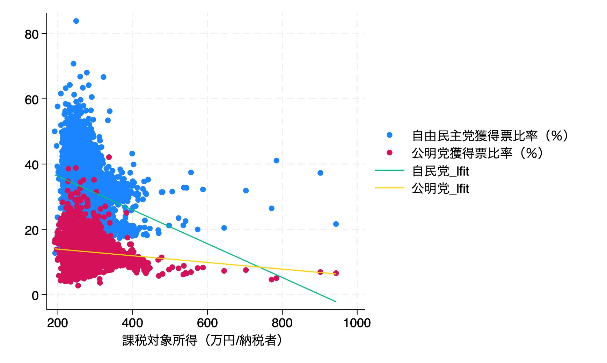

## 設問１
Sumを用いて、各政党の得票率また課税対象の基礎統計量を記述する。
```stata
. sum r_jimin

    Variable |        Obs        Mean    Std. dev.       Min        Max
-------------+---------------------------------------------------------
     r_jimin |      3,773    31.75969     9.08359    6.83101   83.82724

. sum r_komei

    Variable |        Obs        Mean    Std. dev.       Min        Max
-------------+---------------------------------------------------------
     r_komei |      3,773    13.25946    4.253784   2.740123   42.11248

. sum income_pop

    Variable |        Obs        Mean    Std. dev.       Min        Max
-------------+---------------------------------------------------------
  income_pop |      3,474    275.4725    47.47892   191.4445   943.5259

```


Scatter plotを用いて、かく政党の得票率と課税対象所得の分布を示す。
```stata
scatter r_jimin income_pop || scatter r_komei income_pop || lfit r_jimin income_pop, leg(label(3 "自民党_lfit")) || lfit r_komei income_pop, leg(label(4 "公明党_lfit"))
```

また、自民党と公明党どちらが高い方のみの得票率を持つかを示すために、以下のように条件を付けてscatter plotを作成する。
```stata
scatter r_jimin income_pop if r_komei <= r_jimin || scatter r_komei income_pop if r_komei > r_jimin
```


## 設問２
自民党、公明党の得票率を説明変数に、課税対象所得を目的変数とした回帰分析を行う。
```stata
. gen income_pop_log = log(income_pop)
. reg r_jimin income_pop_log r_pop20bellow r_pop65above r_unemployment D2013

      Source |       SS           df       MS      Number of obs   =     3,426
-------------+----------------------------------   F(5, 3420)      =    666.15
       Model |   138400.45         5    27680.09   Prob > F        =    0.0000
    Residual |  142108.313     3,420  41.5521383   R-squared       =    0.4934
-------------+----------------------------------   Adj R-squared   =    0.4927
       Total |  280508.763     3,425  81.9003688   Root MSE        =    6.4461

--------------------------------------------------------------------------------
       r_jimin | Coefficient  Std. err.      t    P>|t|     [95% conf. interval]
---------------+----------------------------------------------------------------
income_pop_log |  -11.32112   1.054732   -10.73   0.000    -13.38909   -9.253149
 r_pop20bellow |   .0300192   .0823853     0.36   0.716    -.1315102    .1915487
  r_pop65above |   .2760299   .0411845     6.70   0.000     .1952812    .3567786
r_unemployment |  -.8193201   .0638238   -12.84   0.000    -.9444568   -.6941834
         D2013 |    8.22172   .2618114    31.40   0.000     7.708397    8.735042
         _cons |   87.56426   7.683244    11.40   0.000     72.50005    102.6285
--------------------------------------------------------------------------------


. reg r_komei income_pop_log r_pop20bellow r_pop65above r_unemployment D2013

      Source |       SS           df       MS      Number of obs   =     3,426
-------------+----------------------------------   F(5, 3420)      =    111.42
       Model |  8611.47019         5  1722.29404   Prob > F        =    0.0000
    Residual |  52864.9168     3,420   15.457578   R-squared       =    0.1401
-------------+----------------------------------   Adj R-squared   =    0.1388
       Total |   61476.387     3,425  17.9493101   Root MSE        =    3.9316

--------------------------------------------------------------------------------
       r_komei | Coefficient  Std. err.      t    P>|t|     [95% conf. interval]
---------------+----------------------------------------------------------------
income_pop_log |  -.2554804   .6433039    -0.40   0.691    -1.516779    1.005818
 r_pop20bellow |   .2361316   .0502486     4.70   0.000     .1376113    .3346519
  r_pop65above |   .1043676   .0251193     4.15   0.000     .0551172     .153618
r_unemployment |   .7621931   .0389275    19.58   0.000     .6858695    .8385167
         D2013 |   3.135854   .1596845    19.64   0.000     2.822767     3.44894
         _cons |   2.117217   4.686176     0.45   0.651    -7.070772    11.30521
--------------------------------------------------------------------------------

. vif

    Variable |       VIF       1/VIF  
-------------+----------------------
r_pop65above |      6.44    0.155230
r_pop20bel~w |      4.44    0.225303
income_pop~g |      2.01    0.497706
r_unemploy~t |      1.56    0.641662
       D2013 |      1.41    0.707765
-------------+----------------------
    Mean VIF |      3.17

```
以上がStataを用いた回帰分析の結果である。
- 自民党の場合、決定係数は0.4934であり、課税対象所得の説明力は49.34%である。
  - 説明変数のうち、P値を基づいて、0.05の有意水準の場合、課税対象所得、65歳以上人口比率、失業率、2013のダミー変数が有意である。
  - 課税対象所得は負の相関を持つ。
  - 65歳以上人口比率は正の相関を持つ。
  - 失業率は負の相関を持つ。
  - 2013のダミー変数は正の相関を持つ。
  - 多重共線性
- 公明党の場合、決定係数は0.1401であり、比較的に説明力が弱く見える。
  - 説明変数のうち、P値を基づいて、0.05の有意水準の場合、20歳以下人口比率、65歳以上人口比率、失業率、2013のダミー変数が有意である。
  - 課税対象所得は負の相関を持つ。
  - 20歳以下人口比率は正の相関を持つ。
  - 65歳以上人口比率は正の相関を持つ。
  - 失業率は正の相関を持つ。
  - 2013のダミー変数は正の相関を持つ。
- vifの結果から、10の基準から見ると多重共線性の問題がないと言えるが、65歳以上人口比率と20歳以下人口比率が相関係数が高いので、5以上になった。

## 設問３
投票率の決定要因を分析し、Chowテストを行う。
